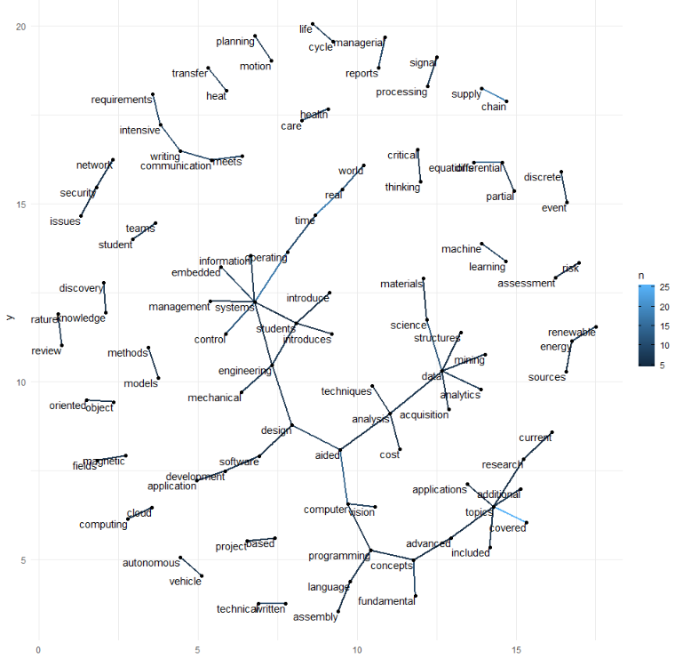
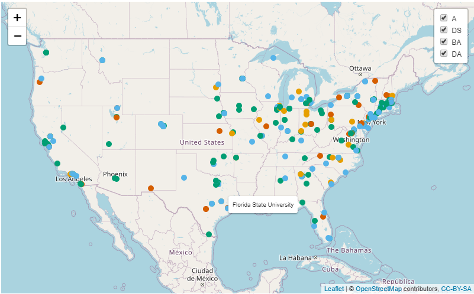

# Fall 2021 Projects - Data Visualization
Compilation of Data Visualization Projects worked on this semester involving Data Science and Business Analytics Curriculum

## Mini Project 01:

The point of this project was to help students and administration see trends and patterns in STEM courses in the State of Florida. For students it could help them figure out if STEM is right for them. For administration, it could help guide them when making different curriculum and organizing different Majors. Data was generated from the Florida Department of Education, specifically the Statewide Course Numbering System. I also wanted to compare Course Descriptions at other Florida Universities vs. at Florida Poly and one of the visualizations I created was a Bi-gram to see what most commonly used words were next to each other and how the words relate to each other in Florida Poly's Course Descriptions.
.

**Sample Visualization:** Bi-Gram of course descriptions of the 383 courses listed in the system for Florida Poly

---

## Mini Project 02:

In this project I was able to create an interactive plot, a spatial visualization, and a Topic Model using LDA. All of these visualizations were made to see the growth of Analytics, Business Analytics, Data Analytics, and Data Science MS Degrees. The map can also allow anyone to sort through about 300 schools and click their degree page based on location of the university and what subject they are interested in. I created my own dataset based on findings from "https://analytics.ncsu.edu/?page_id=4184". 

**Sample Visualization:** Leaflet Map that allows user to hover over each point to view the name of the University. User can also click each point and that will give the link to each Universities Degree page. User also has the option to view each degree subject by itself or a combination of the 4 MS Degrees.

